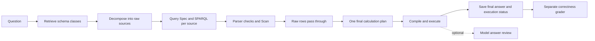

**V6 note (14 September 2026):** This directory is now the V6 launcher. See [V6_PLAN.md](V6_PLAN.md) for the active scope and evaluation contract. The historical V4 notes below are retained for provenance and should not be used as the V6 run command.

**Latest review:** see [FINAL_REVIEW.md](FINAL_REVIEW.md) for the end-to-end audit, additional fixes and remaining gaps. All **159 offline tests pass**, production imports pass, and actual local Fuseki metadata now preserves exact date/numeric datatypes. Raw retrieval contracts preserve optional properties; parser checks reject aggregates/limits; empty Scan headers are checked; diagnostics retain executed queries; existence filtering has explicit SQL duplicate/null behavior. These are verified local fixes, not a fresh model accuracy score.

**13 September cleanup:** the current default version is `aop-improvement3-v4-short-prompts`. Active prompts now define their terms, Decompose requests a smaller source plan, duplicated context is removed, and five inactive operators are removed from the V4 registry/imports. Classify and Extract files and unused classifier handling have also been deleted. A Python helper now validates declared connection endpoints and carries their schema-valid keys into each raw retrieval, including composite keys, without a model call. See [the complete operator inventory](OPERATOR_USAGE.md). The earlier behavior and run instructions below describe the preceding revision; use fresh report files and the current version label for new comparisons. These changes do not claim an accuracy improvement or implement the entire correctness plan.

V4 was copied from V3, then simplified and repaired here. The preceding version was `aop-improvement3-v4-simple`. All implementation changes in this revision are under `run_pipeline_v4`; the original baseline, original grader, datasets, and saved run CSVs were not rewritten. No question IDs, expected answers, reference SQL, or benchmark-specific thresholds are used during inference.

**What the completed CSVs actually show**

| Saved run | Rows | PIPELINE_SUCCESS | Other statuses |
| --- | ---: | ---: | --- |
| v3_simplified_v7_success_55 | 55 | 43 | 11 final-plan, 1 decomposition |
| v3_simplified_v7_non_success_137 | 137 | 48 | 80 final-plan, 4 pre-scan, 3 decomposition, 2 retrieval-spec |
| Combined V3 | 192 | 91 | 101 failures |

The earlier files named `v4_typed_repair_*` represent another implementation. They contain 179 rows and 81 pipeline successes; the file ending in `non_success_137` contains only 124 rows, so 13 expected rows are absent. Those files do not evaluate this new V4.

The separately graded V3 prior-success subset contains 26 MATCH, 8 PARTIAL, and 9 MISMATCH among 43 completed executions. The other 48 V3 successes were not graded in that supplied grading file.

The main V3 failure families overlap: 38 failed to produce an accepted final-plan JSON shape, 29 referenced a missing input column, 23 collided on column names after repeated joins, 9 forced text through numeric arithmetic, 8 used unsupported aggregate JSON spellings, and 4 failed on logical branch dependencies. Old missing-plan errors discarded the raw response, so those 38 cases cannot reliably be attributed to malformed JSON versus wrappers, truncation, or empty output.

See [the audit](docs/completed_run_audit/FINDINGS.md) and [saved statistics](docs/completed_run_audit/saved_run_audit.json).

**Why the baseline appeared to have all pipeline successes**

The baseline runner assigns PIPELINE_SUCCESS after execution even when its semantic validator rejects the answer. V3 instead required the validator to approve and discarded the computed output after disagreement. They were measuring different things with the same status name.

V4 makes the distinction explicit:

| Field | Meaning |
| --- | --- |
| New Status = PIPELINE_SUCCESS | Retrieval, plan compilation, and deterministic execution completed and produced a structured final result, including a legitimate empty list. |
| Answer Review Status | not_requested by default; accepted, rejected, or unconfirmed when optional model review is enabled. A rejected review does not become an accepted review. |
| Grade Status | MATCH, PARTIAL, MISMATCH, or an explicit grading failure from the separate grader. |

Missing input tables/columns, invalid SPARQL, malformed plans, failed scans, and runtime errors still fail. This does not guarantee every query will succeed or that every completed result is correct.

**What changed**

- Fixed DAG: Python creates the same retrieval branches and one final calculation node. There are no model-generated DAG candidates or reward-model selections.
- Pre-scan validation checks SELECT syntax and declared projection with the SPARQL parser. It no longer asks another model to veto a valid optional date/non-null filter or demand another branch inside the current branch. Scan still executes against the actual database.
- Processing preserves raw rows without a model call. Final planning now requests one ordered `final_steps` list plus projection, rather than asking the model to partition work across four sections. Older recorded forms remain supported for compatibility.
- Final planning receives compact actual table profiles, retrieval predicates, and schema-derived IRI join options. It explicitly distinguishes full resource IRIs from short literal IDs. No join is guessed from question IDs or expected outputs.
- Text copying, COALESCE, and NULLIF preserve types. Only arithmetic requires numeric operands. The saved label-copy crashes are fixed.
- Repeated joins share one naming function between compiler and runtime. Existing columns survive; repeated right-side collisions become `_right`, `_right_2`, and so on, preserving rows and multiplicity.
- Known unambiguous model spellings now work: explicit aggregate functions in `agg`/`agg_operation`, left_outer joins, equality-style join key pairs, single-item expression lists, wrapped final plans, and unambiguous branch/class dataset aliases. Unknown functions and ambiguous bindings still fail; missing aggregate functions are not guessed.
- Source-qualified fields normalize only when the qualifier names the active source and the field exists. Exact categorical literals and assigned predicates remain checked. Earlier model guesses about final display/grouping fields no longer force every source to retrieve them.
- Logical `depends_on` annotations move to descriptive metadata. Raw scans remain independent and the final plan applies relationships. Duplicate branch IDs and nonexistent predicate branches remain errors.
- Optional final review runs once when requested; there is no reviewer-driven loop that replaces a completed calculation. It records disagreement separately. Use `FINAL_SEMANTIC_REVIEW=1` to enable it; default is `0`.
- An unused retrieved branch produces a plan warning rather than an execution failure. A requested input that does not exist remains an error. Whether all required sources are represented is an answer-correctness question for review/grading.
- Debug output retains complete plan declarations and valid JSON. Failed final responses include their raw excerpt, length, truncation flag, and finish reason. This makes future model-format failures diagnosable.
- The V4 grader reads `New Pipeline Result`, including `[]`, rather than a raw scan. It preserves New Status and writes separate Grade Status/Grade Reason. All failed executions are skipped, and malformed answer cells are explicit errors. The user's grading model and semantic criteria remain unchanged.

The intended flow is:



**Verification and its limits**

128 offline tests pass, covering actual compiler/operators/executor, SQL comparisons, RDF metadata, parser checks, optional reviewer behavior, fixed DAG generation, and final-answer grading. V4 production imports successfully with the configured GPT-OSS 120B model and existing dataset/schema paths. No live external-model evaluation was performed in this revision.

The completed V3 logs retained 136 replayable final plans. On identical saved branch samples:

| Check | V3 | V4 |
| --- | ---: | ---: |
| Plans executing without errors on available samples | 83 | 105 |
| Compile errors | 37 | 21 |
| Runtime errors | 8 | 0 |
| Compile passed, complete branch samples unavailable | 8 | 10 |

22 previously failing plans now execute on their saved samples, with no regressions among the 83 that previously executed. These samples contain at most five rows per branch, so this is runtime compatibility evidence, not an end-to-end success score or correctness grade. Fifty-one rows lack retained final declarations and five have truncated/invalid saved JSON. The 21 remaining compile errors need valid model plans or retrieval repairs; this code does not silently invent their missing bindings.

[Replay results](docs/completed_run_audit/final_plan_replay.json) record per-query errors. The V3 directory disappeared from disk during this work without an assistant delete/move operation. The original copy hashes are retained in [v3_copy_manifest.json](docs/v3_copy_manifest.json). Replay now preserves the previously computed V3 comparison only when the source CSV hashes match; it does not reconstruct or modify V3.

**Run V4**

From the financial workspace root, start with a fresh report:

```powershell
$env:INPUT_QUERY_CSV = 'C:\Users\AMAN KUMAR SINGH\Desktop\financial\experiment_week1\improvement3\pipelien_output\v1_pipeline_success_input.csv'
$env:TEST_QUERY_LIMIT = '20'
$env:TEST_QUERY_OFFSET = '0'
$env:FINAL_SEMANTIC_REVIEW = '0'
$env:GPT_OSS_LLM_GRADER_PIPELINE_VERSION = 'aop-improvement3-v4-simple'
$env:REPORT_FILE = 'C:\Users\AMAN KUMAR SINGH\Desktop\financial\experiment_week1\improvement3\pipelien_output\v4_simple_smoke_20.csv'
python experiment_week1/improvement3/run_pipeline_v4/run.py
```

For the complete 442-question workbook, set INPUT_QUERY_CSV to an empty string, INPUT_SAMPLE_FILE to your workbook path, TEST_QUERY_LIMIT to 442, and choose a new REPORT_FILE. Use the V4 launcher above; the older `run_pipeline_improved3.py` launcher is not changed by this revision. A new report filename avoids mixing older runs with changed code.

Grade the actual final answers:

```powershell
$env:RAW_REPORT_FILE = $env:REPORT_FILE
$env:GRADED_REPORT_FILE = 'C:\Users\AMAN KUMAR SINGH\Desktop\financial\experiment_week1\improvement3\pipelien_output\graded_v4_simple_smoke_20.csv'
python experiment_week1/improvement3/run_pipeline_v4/grade_final_answers.py
```

Local checks, without model calls:

```powershell
python -m unittest discover -s experiment_week1/improvement3/run_pipeline_v4/tests -q
python experiment_week1/improvement3/run_pipeline_v4/docs/completed_run_audit/replay_final_plans.py
```

All-success execution and 350 correct answers remain targets to measure with a fresh run, not claims established by these fixes. Increasing PIPELINE_SUCCESS by separating review status does not itself increase correctness; the runtime repairs and simpler model interface must be evaluated independently.
