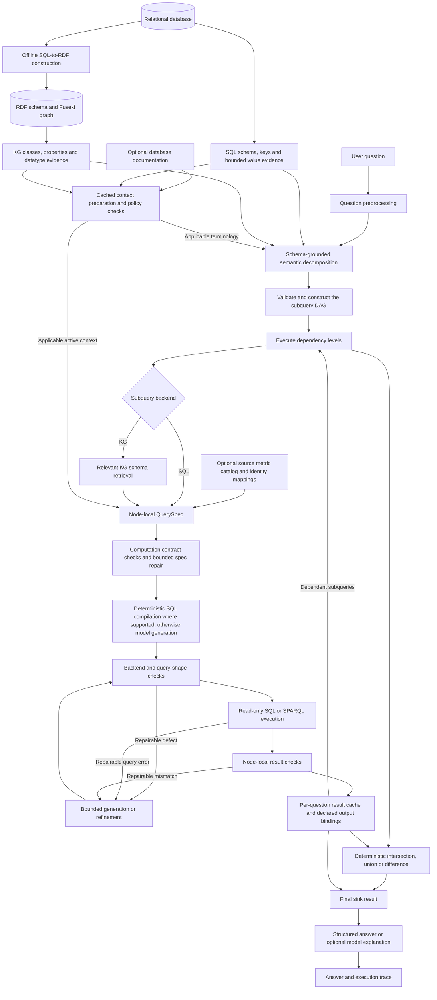
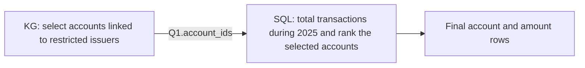

# Architecture and methodology of the current orchestrated enterprise query pipeline

This document describes the current shared implementation in `script_diff_llm2`, including the reliability v6 changes and the optional document-context preparation path. It is an architecture and methodology write-up, not a results section. The comparison uses the Improvement 6 code on local `main`, commit `97f3d8459ee68a73a5b8c3390e847831bf00bec4`, under `experiment_week1/improvement6`. At inspection, local `main` and `origin/main` pointed to the same commit. The current pipeline is described from working-tree source, including uncommitted changes, rather than from an older v5 output or diagram.

## 1. Research motivation and relationship to the preceding system

Enterprise questions often combine several kinds of reasoning within a single natural-language request. An analyst may ask for entities satisfying a relationship condition, apply a temporal restriction to their transactions, compute a financial measure, and rank the resulting entities. Answering such a question requires more than translating words into database syntax. The system must establish which source owns each attribute, identify the relevant population, preserve the intended calculation grain, and apply conditions at the correct stage of computation.

We develop an orchestrated system in which language-model operators interpret the request and construct explicit plans, while database engines and deterministic operators perform the actual computations. The model supplies a proposed interpretation of the question; enterprise data supplies the facts. Intermediate representations connect these two roles and make the interpretation inspectable before and after execution.

The system follows the operator-oriented approach of Improvement 6, retaining structured planning, schema grounding, validation, repair, and separation of answer generation from evaluation. Its main architectural change is the unit of decomposition and execution. Improvement 6 decomposes a question into raw retrieval branches and subsequently constructs a calculation plan over the retrieved records. The current system decomposes the question into executable semantic subqueries, assigns each subquery to SQL or the knowledge graph, and constructs a dependency graph that coordinates their results. Each subquery has its own computation specification and is implemented by a backend query.

Consequently, the follow-up should not be described as merely adding decomposition to a system that lacked it. The inspected Improvement 6 implementation already contains decomposition. The distinction is between **decomposition into raw source retrievals followed by a final calculation plan** and **decomposition into backend computations connected by explicit dependencies and set operations**.

## 2. System inputs and knowledge boundaries

The answering system accepts a natural-language question, a configured relational database, and an RDF knowledge graph derived from that database and exposed through a SPARQL endpoint. The SQL database and KG are complementary representations of shared enterprise records, not independent factual databases. SQL and graph metadata remain separate because their physical names, datatypes, and identifier encodings need not coincide. A relational table name is not assumed to be an RDF class name, and a relational identifier is not assumed to equal the suffix of a graph IRI. The RDF export also includes metadata and additional relationship/context structure; shared record provenance does not imply that every graph triple is a copied SQL cell.

The current relational implementation uses SQLite. The graph implementation uses RDF schema files and Apache Jena Fuseki for instance queries. These are concrete backend implementations, not evidence of support for every SQL dialect or every graph platform. Model, source, and experiment settings are configured separately from the reusable planning and execution code.

Two optional sources can supply additional meaning. A source-owned semantic catalog can define documented metrics and explicit identity mappings. A document-context preparation component can extract candidate terminology and policies from independently supplied database documentation. Both are runtime inputs rather than definitions built into the generic orchestration logic.

Reference answers are outside the answering interface. The benchmark runner can load reference answers and overrides to construct reports, but the planner and executor receive the question, not its reference answer. This separation is an interface boundary within the implementation; it is not a claim that the benchmark harness never reads reference data. Likewise, source documentation must have independent provenance: moving an answer-derived rule into a JSON file would not make it independent enterprise knowledge.

## 3. Overall architecture

The runtime separates preparation, question interpretation, node execution, and answer presentation:



The diagram represents the main flow; SQL and KG repairs have different implementation details. RDF construction is an offline source-preparation step, not a conversion performed by the answering runner on each query. The diagram also does not imply that every question uses both backends or a set operation. A single complete SQL or KG subquery is a valid and often preferable plan.

There are two distinct levels of orchestration. The outer level is a query-dependent graph of semantic subqueries and set operations. The inner level is the largely fixed execution procedure used to answer each SQL or KG subquery. The outer topology is dynamic; the operator vocabulary and backend procedures constrain what that topology can express.

The following conceptual procedure summarizes how the components fit together. It describes control flow rather than introducing another implemented planner:

```text
Prepare source metadata and any configured catalog/context.
For each question:
    Normalize its text and resolve supported, unambiguous graph aliases.
    Propose subqueries, backends, scope clauses, and dependencies.
    Validate the proposed graph; fall back to a full-question node if necessary.
    For each topological execution level:
        Skip nodes whose predecessors failed.
        Execute eligible nodes concurrently within the worker bound:
            Resolve the declared predecessor outputs.
            For a set node, combine predecessor entity keys deterministically.
            For a database node:
                Build and check the node-local computation specification.
                Compile or generate one backend query.
                Validate, execute, and apply bounded repairs where appropriate.
                Record result rows, diagnostics, and the declared outputs.
    Produce an answer from the final sink, or report a failed graph.
    Save the question-level result and detailed trace.
Grade saved answers separately, when evaluation is requested.
```

## 4. Runtime preparation and schema grounding

Before answering questions, the system loads physical metadata for both backends. SQL metadata includes table and column names, declared types, primary keys, and foreign keys. Bounded profiling also exposes complete small observed text domains. The profiler omits domains that exceed its value or execution budgets rather than presenting an incomplete sample as the complete set of permitted values.

Graph metadata combines schema descriptions with information discovered from Fuseki. It exposes classes, properties, property URIs, observed literal datatypes, and available relationship targets. Small observed literal domains can help resolve source spelling and categories. Namespace information remains important: matching a property by its local name alone does not establish that it belongs to the intended vocabulary.

This preparation grounds subsequent prompts in the configured sources. It provides evidence about what can be queried, not a complete account of what every business concept means. For example, observing that a field contains three category labels does not establish an eligibility policy, a scoring formula, or a financial threshold. Such meanings must come from the question or documented source metadata.

The decomposition operator receives a compact view of the SQL tables and columns and a lightweight KG index. This keeps backend selection tied to the available sources without requiring decomposition to produce full executable queries. Later stages receive more detailed metadata appropriate to their assigned backend.

## 5. Decomposition as the central planning representation

### 5.1 What decomposition does

The decomposition operator converts a question into a JSON description of an executable directed acyclic graph. It decides which parts can be answered together, which parts require separate backend work, which results depend on earlier results, and whether independent entity sets need to be combined.

This is semantic task decomposition, not sentence splitting. Two clauses can belong in one node when they are naturally answered by one backend query. Conversely, one sentence can require several nodes when it crosses source representations or contains a dependency between an initial entity selection and a subsequent calculation.

For a question \(q\), the operator proposes a graph \(G_q=(V_q,E_q)\). Each node contains a unique identifier, a local natural-language description, an operator name, and, for database subqueries, a backend assignment. Nodes can additionally declare input bindings, output fields, and verbatim clauses from the question identifying their responsibility.

The supported outer operator vocabulary is:

\[
\mathcal{O}=\{\text{Subquery},\text{Set\_Intersect},\text{Set\_Union},\text{Set\_Difference}\}.
\]

A `Subquery` is a complete backend task. SQL verbs such as `JOIN`, `SELECT`, and `COUNT` are not executable outer DAG operators. Joins, formulas, aggregations, normalization, and ranking belong inside a subquery's computation specification and backend query when required.

### 5.2 Choosing the smallest semantically sufficient plan

Decomposition aims to retain the smallest correct graph. A direct lookup, an aggregation supported by one backend, or a direct existence or absence condition can remain one node. Splitting an ordinary anti-join into separate universes and later recombination can introduce unnecessary bindings and change the eligible population; the prompt therefore prefers a direct backend query when it expresses the request faithfully.

This choice matters for both semantics and runtime cost. Every additional node introduces another local interpretation and another interface whose output must satisfy a consumer. Additional nodes are useful when they separate meaningful responsibilities, not simply because the question is long.

The implementation does not compute a formal minimum-cost plan. It instructs the model to prefer a small correct graph and applies structural checks to the result. The planner class name and historical `multi_candidate` log label should not be interpreted as evidence of candidate search: the current `plan_optimal_dag` calls decomposition once and ignores its candidate-count and planning-round parameters.

### 5.3 Preserving question scope

For multi-node plans, backend nodes must provide nonempty `scope_clauses` that match text in the original question after case and whitespace normalization. These clauses identify which requested conditions or outputs belong to each node. If this basic source-text grounding is absent, the proposed decomposition is rejected.

A date restriction must remain attached to the event or condition it modifies. Likewise, a condition assigned to one sibling branch should not appear automatically in every other branch. The root question supplies shared context; the local subquery description specifies the node's executable responsibility.

For a single database node, the runtime restores the original question as the node description. It clears speculative input and output bindings because there is no downstream consumer. This protects the full user request from an abbreviated model paraphrase and leaves the actual final answer schema to QuerySpec.

The scope checks establish textual provenance, but they do not prove complete semantic coverage. A quoted clause can still be interpreted incorrectly, and a model can omit a condition. QuerySpec requirements and later checks provide further evidence rather than a formal proof of equivalence to the original question.

### 5.4 Dependencies and declared interfaces

An input binding names one upstream output using the exact form `NODE_ID.output_name`. For example, a later transaction calculation can consume account identifiers emitted by an earlier graph traversal. The output name is an interface between nodes, not an invented physical field. QuerySpec must project the required value under that name using a schema-grounded field or alias.

Nodes also carry type labels, such as an array of entity identifiers. These labels document the intended interface and appear in graph traces. They are not a complete static type system: the runtime checks references and resolves actual values, but does not formally prove all declared types equivalent across sources.

The planner checks unique node identifiers, supported operators, valid backend names, referenced producers and output fields, absence of self-dependencies, acyclicity, and a single final sink. A plan with unsupported operators, invalid references, a cycle, or multiple disconnected final results is replaced with a single node preserving the full question. If the rejected plan consistently selected one backend, that choice can be retained; otherwise a generic wording heuristic supplies the fallback backend. This fallback preserves question scope but cannot guarantee that the chosen backend is semantically optimal.

Compound records require particular care. An entity identifier and its associated group label must not be converted into unrelated lists when downstream work needs their row relationship. The decomposition prompt explicitly discourages such interfaces. The current binding mechanism can pass named values or columns extracted from structured rows; it is not a general relational transfer engine for arbitrary compound intermediate records.

### 5.5 SQL and KG routing

Backend selection is made during decomposition for each subquery. SQL is encouraged for relational filtering, aggregation, and ranking. KG is encouraged for relationship traversal and multi-hop entity connections. Both routes can access representations of the same source records. A relationship-and-aggregation question therefore does not inherently require a cross-backend join: one representation may contain everything needed. These are generic routing preferences conditioned on runtime metadata, not mappings from particular benchmark questions to particular backends. The present runtime does not automatically derive a complete SQL-to-KG coverage map or use that map to prove that a routing choice is optimal.

There is no separate active intent-classification agent between decomposition and node execution. A classification function remains in the source, but the current planner/executor path does not invoke it. QuerySpec records the node's query type as part of the computation contract.

### 5.6 An illustrative dependent decomposition

Consider this hypothetical request:

> Among accounts linked to restricted issuers, show the five accounts with the highest total transaction amount during 2025.

If the graph represents account–issuer relationships and SQL stores transactions, an appropriate plan can contain two nodes. A KG subquery selects accounts satisfying “accounts linked to restricted issuers.” A dependent SQL subquery consumes those account identifiers, calculates total transaction amount during 2025, and selects the top five accounts.



The first node need not aggregate transactions or apply their date restriction. The second node must not broaden its population beyond the accounts supplied by the first node. Its backend query performs the grouping, sum, and ranking; a separate Final Spec does not calculate those operations afterward.

This example uses hypothetical schema names and assumes a documented relationship path and verified cross-backend identity mapping. It is explanatory, not a built-in decomposition template or a claim that the present database contains those exact objects. If one backend can express the full request, the system can instead retain a single node.

## 6. Integration of decomposition with QuerySpec

For every database node, QuerySpec translates the local task into a schema-grounded JSON computation plan. It receives the local description, the root question, the backend schema, upstream bound values, and any output fields required by downstream consumers. Relevant source metric definitions and active context entries can supplement these inputs.

The contract describes:

| Component | Purpose |
|---|---|
| Query type, base entity, and entity key | Identify the requested computation and its comparison or output population. |
| Required sources and field ownership | Bind each measure, dimension, and predicate to physical schema objects. |
| Shared filters and predicate structure | Preserve the eligible population and logical condition scope. |
| Grouping and aggregation grain | Distinguish raw records, entities, and final groups. |
| Measures and formulas | State operands, aggregate operations, stages, units where known, and output aliases. |
| Measure-specific population and aggregate filters | Distinguish filters on raw inputs from thresholds on calculated values. |
| Join policy and missing-value policy | Express required participation, optional relationships, and explicitly justified defaults. |
| Ranking | Specify the metric, direction, and requested limit. |
| Execution strategy and output schema | Describe a single backend query, potentially with internal preaggregation, and its final columns. |
| Requirement ledger and unresolved requirements | Connect question clauses to plan components and expose unsupported interpretations. |

The decomposition and QuerySpec serve different purposes. Decomposition establishes coordination between tasks. QuerySpec establishes the detailed computation within a task. An upstream output contract constrains what a producer must expose; an upstream input constrains what a consumer may consider. The root question does not license either node to absorb conditions assigned elsewhere in the graph.

The runtime checks that requested downstream output names appear in the producer's QuerySpec output schema. It also checks physical sources and fields, formula operands and alias dependencies, supported operations, ranking structure, and other contract properties. Unknown schema objects, unresolved requirements, invalid computations, and cyclic derived expressions can block execution. Defects in requirement prose or ledger references are retained as warnings rather than all being treated as hard failures.

Malformed JSON can trigger a formatting repair; missing analytic measures can trigger a recovery request; blocking contract defects can trigger a bounded repair request. Repairs must preserve the question and grounded inputs. If a metric definition is absent, the intended behavior is to retain an unresolved requirement rather than fabricate a formula to satisfy the validator.

## 7. Calculation grain, population, and financial semantics

The computation contract makes grain explicit because apparently similar averages can answer different questions. Let entity \(i\) have observations \(x_{ij}\), and let \(P\) be the eligible entity population. A mean across observations is

\[
\bar{x}_{\mathrm{observations}}=
\frac{\sum_{i\in P}\sum_j x_{ij}}{\sum_{i\in P}n_i},
\]

whereas an equal-weight mean of entity means is

\[
\bar{x}_{\mathrm{entities}}=
\frac{1}{|P|}\sum_{i\in P}\left(\frac{1}{n_i}\sum_j x_{ij}\right).
\]

These expressions need not agree. An average of entity totals uses an inner sum and an outer average instead. The plan must select the operations from the question or source definition, rather than assuming that every grouped average has one universal interpretation. The notation assumes the stated inputs are eligible and present; real queries must additionally implement the requested missing-value policy.

Independent one-to-many sources introduce another risk: joining raw child records can multiply observations. Where required, the plan represents separate entity-level summaries before combining them and applying final grouping. The resulting SQL can use common table expressions or subqueries; SPARQL can use nested subselects. This is **internal staged computation within one backend subquery**, distinct from creating several outer DAG nodes.

Filter stage is similarly explicit. A condition on an entity's mean must be evaluated after the mean is calculated, not implemented by removing low-valued observations before calculating it. A condition affecting one metric's contributors must not silently filter the inputs of every metric. The plan therefore separates shared filters, measure-specific input filters, and aggregate filters with entity/final-group stages and population/metric scopes.

The same principle applies to signed values, normalized scores, and denominators. An explicitly requested sum of a stored signed amount preserves its recorded sign unless the question or independent documentation defines a transformation. Min–max normalization must use the eligible population before ranking. Missing values, absent related records, and zero values remain distinct unless their equivalence is explicitly defined.

These are computation principles, not hard-coded financial formulas. A named metric whose operands or definition are unavailable remains unresolved. Schema portability does not imply that business meanings can be inferred automatically from field names.

## 8. Backend execution

### 8.1 SQL subqueries

The SQL path builds QuerySpec against the relational schema directly; it does not call the KG retrieval operator. After contract validation, the generator first checks whether the specification belongs to a supported deterministic compilation pattern. Current patterns include restricted single-source projections and filters, single-source aggregations, grouped entity counts, and certain explicit entity-to-final-group computations.

These compilers render supplied plan semantics. They are not a universal translator for arbitrary QuerySpecs. Unsupported features or combinations fall back to model-based generation. Failure feedback also bypasses the deterministic fast path so that a repair does not reproduce an unchanged failed query.

Model generation receives the QuerySpec, relevant physical schema, local question, upstream bindings, and repair feedback when present. Its output must implement the declared columns, operations, population, and grain in SQLite-compatible SQL. One subquery generates one executable SQL statement, although that statement may contain multiple internal stages.

The SQL validator prepares the statement with `EXPLAIN` against the actual database in read-only mode, catching syntax and physical-schema defects before execution. Additional shape checks inspect aggregation staging and join population/policy, and a model-based pre-scan validator reviews the proposed implementation against the local computation contract. The scan itself uses a read-only connection with `query_only` enabled and returns structured rows.

### 8.2 Knowledge-graph subqueries

The KG path first retrieves relevant classes from a lightweight schema index. QuerySpec then plans against the retrieved schema, with access to full metadata where necessary. SPARQL generation receives the computation contract, actual graph vocabulary, and node-local inputs. It can implement relationship paths, existence and absence conditions, aggregation, and ranking as required by the node.

The graph path checks available terms and datatype constraints, uses pre-scan validation, and executes SPARQL through Fuseki. Syntax, unknown-term, and supported semantic defects can trigger bounded regeneration or refinement. The graph metadata and query constraints provide grounding; the system does not claim unrestricted OWL theorem proving or completeness for arbitrary financial reasoning.

## 9. Dependency execution and deterministic composition

The executor partitions the DAG into topological levels. Nodes in a level have satisfied dependencies and can execute concurrently within the configured worker bound. The implementation completes a level before beginning the next one; it is not a continuously scheduled executor that immediately starts every newly ready successor.

Each question has its own result cache. A dependent node resolves declared values from an upstream result or extracts the named field from its structured rows. A missing binding causes a binding error. In the current path, a dependent subquery with an empty bound list returns an empty successful result without querying a broader population. This behavior supports subset-style dependencies; it should not be generalized into arbitrary semantics for every possible empty input.

If an upstream node fails, dependent nodes are skipped and the question records an error. The executor does not present a partially completed DAG as a fully successful answer. Independently runnable nodes can still complete and contribute diagnostic traces.

Set nodes combine canonical keys deterministically:

\[
S_{\cap}=S_1\cap S_2,\qquad
S_{\cup}=S_1\cup S_2,\qquad
S_{\setminus}=S_1\setminus S_2.
\]

They operate on distinct entity keys rather than arbitrary SQL bag semantics. Intersection and difference retain matching representative rows from the first input. Union can emit an `entity_id` row for a key absent from that first input. The set layer does not perform a general attribute-enriching join or recompute financial measures across the combined sets. A question requiring those calculations must assign them to an appropriate backend subquery.

Cross-backend identity is handled explicitly. Graph IRIs retain their identity unless a source-owned catalog declares a verified namespace-to-SQL-key mapping. Matching URI suffixes, similar display names, or incidental overlapping values is not sufficient. However, the RDF export also preserves SQL identifier literals. A KG producer that projects the verified literal identifier can bind to the same SQL key without stripping an IRI or using a namespace conversion catalog. Producer projection therefore matters: a full IRI and a source identifier literal are different values even when they describe the same record. Separately, an RDF alias map helps resolve user-visible compact spellings to graph identifiers during question preprocessing; that lookup is not an automatic proof of SQL/KG identity equivalence.

## 10. Validation and bounded repair

Validation is distributed across interfaces rather than implemented as one final correctness judgment. The outer graph checks execution structure. QuerySpec checks computation structure and schema bindings. Query validation checks the generated statement. Result validation checks observable output properties, such as requested columns, entity identity, ranking order and limits, duplicate identities, and relevant empty-result or grouping behavior.

These checks are local to the subquery. A branch should not fail for omitting another branch's predicate or a calculation assigned to a downstream node. This locality is what allows decomposition to remain a meaningful separation of responsibility throughout execution, rather than only an initial formatting step.

Repair budgets are configurable and finite. Repair prompts include the failed query or contract, actual error feedback, and the applicable specification. SQL scan repair preserves QuerySpec and upstream constraints; it regenerates query implementation rather than inventing a new meaning for the question. KG refinement likewise receives the failed SPARQL and grounded planning context.

Not all checks are strict acceptance gates. The current executor can retain an aggregation-shape warning after its repair budget and attempt execution. After unsuccessful post-scan semantic repair, it can retain the original successful scan rather than discard executable data. Therefore, execution success and a clean validation result must be reported separately. The trace exposes warnings and validation outcomes; successful execution is not a proof that the answer is semantically correct.

## 11. Optional domain-context preparation

The optional context component provides a controlled way to adapt the same answering machinery to different enterprise sources. It accepts an introduction document and a business-rules document through explicit configuration. Without supplied readable documents, and when context is not required, it returns before making a preparation model call or adding context to answering prompts.

At startup, the component checks documents for evaluation-scoped content and excludes detected evaluation documents from preparation and inference. The current `phase0_business_rules.md` explicitly describes correction of disputed ground-truth rows and is quarantined by this mechanism. Consequently, a run configured with both current files must not be described as applying all Phase 0 rules: only eligible, validated, active entries are available to the answering path.

For eligible documentation, a preparation model proposes entries with a topic, kind, matching terms, physical source, fields, backend, definition, and exact supporting quotation. The runtime checks that the quote occurs in the document, the fields and source exist, the representation is valid, and reported conflicts do not remain unresolved. Duplicate identifiers and conflicting topic definitions are disabled. Operational content cannot become automatically active merely by being labeled terminology.

Valid terminology can activate automatically. Definitions, defaults, constraints, and advisory policies require explicit evidence-hash-bound approval. Such approval establishes a review decision; it does not mathematically verify the policy or its implementation. If no useful entries activate, optional mode falls back to the generic pipeline, whereas required mode stops before the benchmark begins.

Preparation results are cached using source document content, schema evidence, model identity, and preparation version. Unchanged inputs can reuse the cache. The system also saves the actual active bundle and fingerprint for the run. This avoids treating “a document path was configured” as evidence that its rules influenced an answer.

At query time, matching is selective and lexical. Decomposition receives applicable terminology only. QuerySpec receives active entries matching the local wording and backend and grounded in the full runtime schema. If an applicable entry identifies a physical source omitted from the retrieval slice, that source can be added to the planning context. This matching is not a general learned semantic retriever and may miss unlisted paraphrases.

Operational meaning must be materialized in ordinary QuerySpec fields so that generation and validation see the same intended computation. Explicit user requests override defaults. Conflicting constraints are reported as unresolved rather than silently altering the request. Advisory entries do not change returned rows, filters, or calculations.

The semantic catalog is a separate optional route for already structured, independently authored metric definitions and identity bindings. It is validated against source schemas and selected by matching terms. A configured invalid catalog stops startup. Catalog definitions guide interpretation; they are not executed as arbitrary external code and do not prove that the resulting backend query implements the definition correctly.

## 12. Answer production and auditability

The answer is derived from the final sink's result. With deterministic explanation enabled, nonempty structured rows are serialized directly as JSON, preserving values and avoiding a further model paraphrase. Empty final results are surfaced by the executor as a no-data outcome. When model explanation is enabled, it uses a bounded result sample; this mode should not be described as a lossless narrative of every returned record.

Execution traces include node descriptions, backend assignments, dependencies, expected outputs, resolved bindings, QuerySpecs, generated statements, scan outcomes, output columns, validation feedback, repair attempts, and timings. Context traces identify entries made available to QuerySpec. They establish availability, not necessarily that every entry was correctly applied. Per-node traces are the detailed record; legacy report columns can flatten information from several nodes and can retain historical names such as `Generated SPARQL` even when the node executed SQL.

Benchmark questions can execute concurrently, in addition to concurrency within a DAG level. Reports are written incrementally using temporary-file replacement. Resume uses row identity and pipeline version; the ablation launcher adds source, configuration, model, and code identity checks to prevent accidental mixing of different runs. Saved questions can be skipped, while unfinished work must be recomputed. This is question-level checkpointing, not persistent checkpointing of every internal node or model call.

The grading program is separate from inference. Its model and scheduling can be configured independently after raw answers have been generated. It does not provide online rewards, choose decomposition candidates, repair answers during inference, or supply ground truth to the answering agents.

## 13. Detailed comparison with Improvement 6

The inspected Improvement 6 tree has an RDF/Fuseki implementation in `run_pipeline_v2` and a SQLite implementation in `run_pipeline_v2_sql`. Both use a fixed branch template and a final calculation planner. Historical comments contain older version names; executable source behavior is the basis for this comparison.

| Architectural dimension | Improvement 6 on inspected `main` | Current `script_diff_llm2` |
|---|---|---|
| Initial planning | Retrieve suggested sources, then decompose into raw retrieval branches. | Decompose using compact metadata for both backends. |
| Decomposition unit | One source/class and its raw records per branch. | One semantically complete backend task, potentially using several sources. |
| Branch relationship | Raw retrieval branches read independently without upstream-ID dependencies. | Subqueries can consume explicitly declared outputs from predecessors. |
| Outer graph | Fixed Query Spec → Generate → Pre-Scan Validate → Scan → Processing Spec template per branch, then Final Spec → Validate → Explain. | Query-dependent graph of Subquery and deterministic set nodes. |
| Backend arrangement | Separate RDF and SQLite variants. | SQL and KG can coexist in one question DAG. |
| Query Spec meaning | Raw source, selected fields, record identity, optional fields, and raw filters; no formulas, grouping, sorting, or limits. | Full node computation contract, including joins/policy, formulas, aggregation grain, grouping, filters, ranking, and final projection. |
| Backend query role | Retrieve raw records. Deterministic rendering covers supported retrieval contracts; fallbacks and repair remain. | Perform the node's complete computation. Restricted deterministic SQL compilers supplement model generation. |
| Processing Spec | In the inspected implementation, a deterministic pass-through preserving raw rows and grain metadata. | No Processing Spec stage in the active path. |
| Final Spec | A model-generated calculation plan executed through Python operators over retrieved datasets. | No Final Spec stage in the active path. |
| Where calculations execute | Final-plan operators perform joins, arithmetic, filtering, aggregation, ordering, date extraction, buckets, and sets. | SQL/SPARQL performs calculations within nodes; the outer executor binds outputs and performs key-based sets. |
| Business-rule context | A bundled business-rule pack is loaded by default and injected into decomposition, Query Spec, and Final Spec prompts. | Generic path has no supplied rule pack; optional validated documentation entries or source catalog definitions provide contextual meaning. |
| Rule precedence | Pack describes addendum/domain precedence and source-specific formulas and policies. | Context activation depends on evidence and review; explicit requests override defaults and conflicts remain visible. |
| Intermediate grain | Raw record identities and multiplicity must survive retrieval for later Python computation. | Backend queries can reduce data to the node's requested grain before inter-node transfer. |
| Result interfaces | Available branch datasets and final-plan step outputs. | Declared `NODE.field` bindings, backend output schemas, and a final sink. |
| Repair boundary | Retrieval/decomposition contracts and final calculation plans can request repairs or missing retrieval. | Invalid outer plans fall back to one full-question node; node specifications and generated queries have bounded repairs. |
| Final assembly | Final Spec interprets all retrieved sources and computes the answer. | The final backend node or set node supplies the answer rows. |

Improvement 6 already contains generic operational safeguards alongside source-specific rules. Its bundled pack includes particular cash-flow categories and sign conventions, financial score formulas, allocation-concentration definitions, cohort averaging defaults, ranking policies, and other domain assumptions. These rules are prompt context even though they reside in a JSON file rather than being written directly into every prompt string. Their presence alone does not prove answer leakage; source provenance and whether rules were derived independently of evaluation must be assessed separately.

The current design moves toward separating reusable coordination from source-owned meaning. It also relocates computation into the selected database backend. This can reduce raw-data transfer and the number of separately planned Python calculation steps when the backend can express the request. In exchange, it places greater demands on QuerySpec completeness and SQL/SPARQL generation. Improvement 6's central calculation plan can express rich record joins across retrieved datasets; the current outer set layer has narrower composition semantics and must route general joins and arithmetic into backend subqueries.

Neither architecture is universally superior by design alone. The follow-up can be presented as a change in orchestration and computation boundaries, with different tradeoffs in plan complexity, intermediate data handling, and source adaptation. Whether those changes improve accuracy, latency, or transfer is an empirical question outside this methodology document.

## 14. Suggested paper-ready methodological framing

We propose a schema-grounded orchestration framework for answering complex enterprise questions over a relational database and an RDF knowledge graph derived from that database. These representations provide complementary execution interfaces over shared underlying enterprise records. A decomposition operator maps each natural-language request to a directed acyclic graph of backend subqueries and deterministic set operations. Unlike decomposition into raw source retrievals, each database node represents a semantically complete computation. Nodes expose declared output fields and consume predecessor outputs through explicit bindings, allowing independent tasks to execute concurrently while preserving dependencies between entity selection and subsequent analysis.

For each node, a query-specification operator constructs a structured computation contract grounded in the assigned backend's runtime metadata. The contract records physical sources, entity identity, predicates, aggregation grain, measure definitions, population constraints, ranking, and output columns. SQL or SPARQL generation implements this contract as a backend query. Restricted deterministic compilation is used for supported SQL specifications; other specifications are translated by the language model. Structural, schema, query, and result checks guide bounded repairs and retain diagnostic evidence when validation remains inconclusive.

The architecture separates generic reasoning procedures from optional enterprise semantics. Independently supplied documentation can be prepared into schema-bound context entries with supporting quotations and provenance. Terminology can assist decomposition, while reviewed operational definitions are materialized in node computation contracts. The generic path remains available when no documents are supplied. Final answers are produced from executed result rows, and the complete graph, specifications, queries, and repair history are recorded separately from evaluation.

Relative to Improvement 6, the proposed follow-up changes decomposition from independent raw retrieval branches followed by a centrally planned Python calculation to dependency-aware backend computations with deterministic outer composition. The contribution is therefore the integration of scope-preserving decomposition, explicit inter-node interfaces, hybrid backend execution, and optional source-grounded context within one orchestration framework.

## 15. Implementation qualifications for accurate paper claims

These points should guide wording and figure captions; they are not results:

- The outer graph is dynamic within a fixed operator vocabulary. The inner subquery procedure is largely fixed. There is no current cost/reward-based candidate DAG search.
- Current question preprocessing normalizes whitespace and transliterates/removes non-ASCII text before planning. Verbatim scope guarantees refer to that preprocessed question. The implementation should not be described as preserving every original Unicode symbol or supporting unrestricted multilingual input.
- Typed annotations describe intended interfaces; they do not constitute a fully enforced static type system or proof of SQL/KG identity equivalence.
- A requirement ledger and verbatim clauses support auditing, but do not prove that every original condition is preserved.
- The active path has no separate Classify, Processing Spec, or Final Spec agent. A registered Math Compute function does not make it an outer decomposition operator.
- Schema grounding limits invented physical names; it does not establish every business meaning, source-document truth, or generated-query correctness.
- Optional context means applicable active entries, not every rule in supplied files. Evaluation-marker detection and provenance checks are safeguards, not a universal contamination detector.
- The reusable logic supports adaptation through source configuration and documentation. It does not yet establish automatic compatibility with arbitrary financial databases, every SQL dialect, or unseen domains without verification.
- Open-weight model choice and privacy-preserving deployment are separate decisions. A hosted API deployment is not automatically private merely because the underlying model has open weights; deployment policy determines data handling.
- “Agents” refers to specialized operators with distinct prompts, inputs, outputs, and responsibilities. They can share the same model/client; the architecture does not require independent autonomous processes or different models for every role.
- The current implementation calls model and backend clients directly. MCP is not an implemented architectural component and should not appear as one in the current-method figure.
- Validation warnings and executable fallback results remain visible. Avoid claims of guaranteed correctness, flawless self-healing, or formal optimality.

## 16. Source map for checking and revising the manuscript

Current implementation paths, relative to `script_diff_llm2`:

| Topic | Primary source |
|---|---|
| Startup, metadata, operator wiring, question scheduling | `src/script_diff_llm/pipeline/core_pipeline.py` |
| Decomposition prompt and source-text scope checks | `src/script_diff_llm/pipeline/decomposition.py` |
| Outer DAG validation and fallback | `src/script_diff_llm/pipeline/dag/planner.py` |
| Node execution, bindings, level scheduling, sets, repair | `src/script_diff_llm/pipeline/dag/executor.py` |
| Computation specification and repair | `src/script_diff_llm/pipeline/specification.py` |
| Schema and requirement contracts | `src/script_diff_llm/pipeline/contracts.py` |
| Result and generated-query shape checks | `src/script_diff_llm/pipeline/semantic_contract.py` |
| SQL compilers, model generation, validation, scan | `src/script_diff_llm/backends/sql.py` |
| SQL metadata and bounded observed domains | `src/script_diff_llm/backends/sql_schema.py` |
| KG metadata and Fuseki access | `src/script_diff_llm/backends/kg.py` |
| Graph retrieval, generation, validation, refinement, aliases | `src/script_diff_llm/pipeline/kg_pipeline.py` |
| Optional document preparation and activation | `src/script_diff_llm/pipeline/domain_context.py` |
| Optional catalog and identity mappings | `src/script_diff_llm/pipeline/semantic_catalog.py` |
| Final answer rendering | `src/script_diff_llm/pipeline/explanation.py` |
| Answering/evaluation boundary and checkpointing | `src/script_diff_llm/evaluation/benchmark_io.py`, `reporting.py` |
| Model-independent ablation configuration and run identity | `ablations/v5_test1000/run_raw.py` |

Baseline paths, read with `git show main:<path>` at the commit stated above:

- `experiment_week1/improvement6/run_pipeline_v2/main.py`: retrieve-before-decompose orchestration and fixed-flow setup.
- `experiment_week1/improvement6/run_pipeline_v2/planner.py`: fixed branch template and Final Spec sink.
- `experiment_week1/improvement6/run_pipeline_v2/llm_operators/decompose.py`: source-wise raw retrieval decomposition and shared predicates/joins.
- `experiment_week1/improvement6/run_pipeline_v2/llm_operators/query_spec.py`: one-source retrieval contract, fields, optionality, and raw filters.
- `experiment_week1/improvement6/run_pipeline_v2/llm_operators/processing_spec.py`: pass-through preservation of raw rows.
- `experiment_week1/improvement6/run_pipeline_v2/llm_operators/final_spec.py`: calculation-plan prompt and supported final operators.
- `experiment_week1/improvement6/run_pipeline_v2/executor.py`, `execution.py`: calculation-plan execution, checks, and repair orchestration.
- `experiment_week1/improvement6/run_pipeline_v2/raw_query.py`: deterministic rendering of supported raw RDF retrieval contracts.
- `experiment_week1/improvement6/run_pipeline_v2/business_context.py`, `business_rule_pack.json`: default pack loading and source-specific prompt context.
- Corresponding files under `run_pipeline_v2_sql`, especially `main.py`, `planner.py`, and `raw_sql.py`: the separate SQLite implementation with the same retrieval/calculation separation.

The baseline comparison is snapshot-specific. If the manuscript's preceding system used an earlier historical version instead, its commit must be identified and this comparison revised against that source. An older general AOP diagram or retained function name is insufficient to establish the executed architecture.
