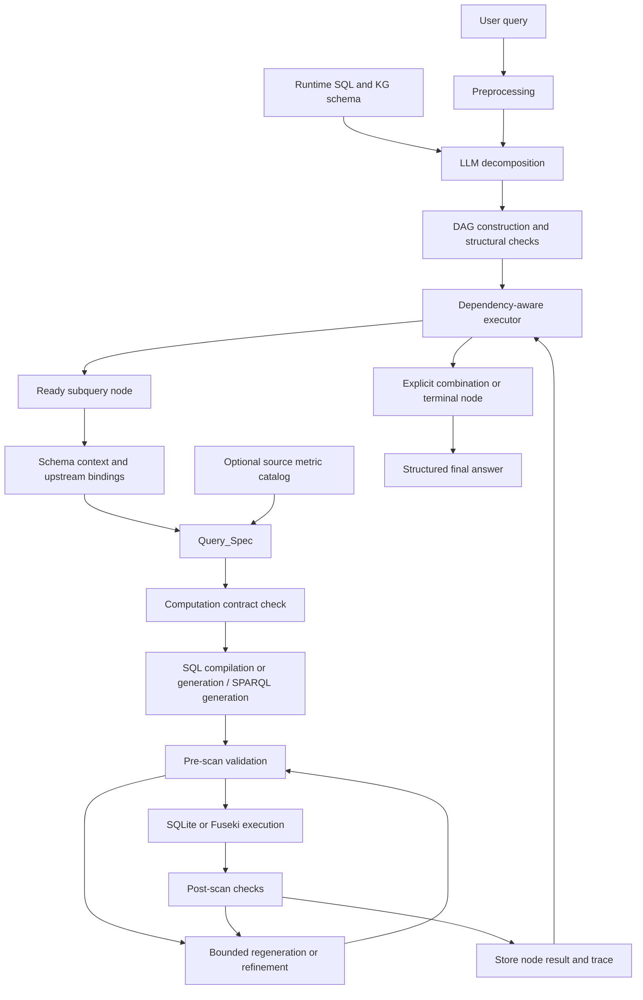

# Approach and Architecture: An Orchestrated System for Enterprise Queries

This writeup describes the current architecture in `script_diff_llm2`. It focuses on the method, with particular attention to query decomposition and its integration with execution. It does not present experimental results. Illustrative examples describe the intended operation of the architecture and are not additional rules embedded in runtime prompts.

## 1. Motivation and overall approach

Enterprise analysts express information needs in natural language, while enterprise knowledge is distributed across structured tables and relationships in knowledge graphs. A question may combine entity attributes, related-record conditions, aggregation, temporal restrictions, ranking, and absence conditions. Answering it requires the system to identify the relevant sources and preserve the relationship between these operations.

The approach uses an orchestrated sequence of specialized LLM operators and deterministic execution components. LLM operators interpret the question, select relevant schema context, specify a computation, generate a backend query, and assist with validation or refinement. Deterministic components construct and schedule the execution graph, bind upstream outputs, execute database queries, combine sets, and format structured answers.

Query decomposition is the main coordination mechanism. It translates an information request into a directed acyclic graph (DAG) of executable subqueries and, where needed, explicit combination operations. This graph specifies the responsibility of each node, its backend, and its dependencies. It connects interpretation of the overall question to the local computations that ultimately answer it.

The architecture is intended to keep the orchestration logic reusable across sources. Physical schema names, relationships, field descriptions and documented metric meanings are supplied as runtime context. The generic planning rules concern computation and coordination: preserve predicate scope, respect dependencies, distinguish aggregation grain, and avoid introducing unsupported meanings.

## 2. Architectural organization

The architecture has two levels of planning.

At the first level, the decomposition operator decides how the overall question should be organized. It produces subquery nodes, assigns SQL or KG execution, declares inputs and outputs, and describes how nodes depend on each other. The planner converts this description into an executable DAG.

At the second level, the Query_Spec operator converts each subquery into a schema-grounded computation specification. This specification identifies physical sources, fields, predicates, measures, grouping, aggregation grain, ranking and final output columns. Query generation then translates the specification into SQL or SPARQL.

The distinction is important: a decomposition node is usually a complete subquery task, rather than one low-level operator such as Scan or Validate. Each subquery invokes its own operator sequence. Decomposition determines coordination between tasks; Query_Spec determines the computation inside a task.

The figure summarizes the overall organization. The exact validation and refinement path differs between SQL and KG execution, and a failed contract stops its subquery before query generation.

## 3. Query decomposition as the coordination mechanism

### 3.1 What the decomposition operator receives

The decomposition operator receives the preprocessed user query and a compact view of the available sources. The SQL context supplies table names and columns; the KG context supplies a lightweight class index. This gives the model a source vocabulary for assigning work to backends.

The model is instructed to preserve the user's terms, literal values, conditions and temporal scope. It should not expand an ambiguous financial expression using its parametric knowledge. For example, a familiar metric name should not cause the decomposition operator to invent a formula. Detailed metric interpretation belongs to the schema and documented source context used during local planning.

The decomposition stage currently receives compact schema context. The optional source metric catalog is introduced at Query_Spec, so the architecture should not be described as passing that catalog to every operator.

### 3.2 What decomposition produces

The output is a JSON description of the nodes that form an execution DAG. Each node contains an identifier, a natural-language task description, an operator, an optional backend assignment, declared inputs and outputs, and source clauses from the question.

| Node field | Purpose |
| --- | --- |
| `id` | Identifies the node within the query plan |
| `description` | States the task that this node must perform |
| `operator` | Selects a subquery task or an explicit combination operation |
| `backend` | Routes a subquery to SQL or KG execution |
| `inputs` | Declares values required from upstream nodes |
| `outputs` | Declares the fields that later nodes can consume |
| `scope_clauses` | Associates a subquery with quoted clauses from the user question |

An input reference such as `Q1.customer_id` means that a downstream node consumes the `customer_id` output of node Q1. The executor uses this reference to construct a dependency edge and resolve the corresponding values after Q1 executes.

The input and output declarations include descriptive type labels, such as lists of entity identifiers. They make the interface between tasks explicit, but the current implementation is not a comprehensive static type system. Source-field validation and runtime binding checks provide additional checks at later stages.

### 3.3 Choosing the size of a decomposition

The decomposition policy prefers the smallest correct DAG. A question that can be expressed faithfully as one SQL query can remain one subquery, even if it joins multiple tables or contains several predicates. The same principle applies to a relationship query that one SPARQL expression can answer.

Splitting becomes useful when parts of the question require different backends, have meaningful independent computations, or depend on an intermediate result. This avoids forcing every complex-looking question into multiple stages.

The policy also discourages unnecessary decomposition of existence and absence conditions. A request for entities without a related record may be represented directly as an anti-join or equivalent graph pattern. Constructing broad intermediate sets is appropriate only when that organization preserves the intended population and operation.

A single-node plan still uses decomposition as a coordination decision: the operator selects a backend and determines that further splitting is unnecessary. The local Query_Spec and execution stages remain active for that node.

### 3.4 Preserving the scope of conditions

A critical responsibility of decomposition is assigning conditions to the correct task. A date restriction on transactions should remain attached to the transaction condition; it should not automatically constrain unrelated events. Likewise, a condition on one branch should not be imported into a sibling branch simply because both are mentioned in the original question.

For multi-node plans, each backend subquery must provide `scope_clauses` drawn from the user query. The implementation checks that these clauses appear in the question after case and whitespace normalization. This creates an auditable connection between the user's wording and the node's assigned responsibility.

For a single subquery node, the planner replaces the model's description with the original preprocessed query. A paraphrase therefore cannot silently become the sole executable interpretation of the complete question.

Quoted clauses support scope fidelity, but they do not constitute a proof that all requested conditions have been covered. Complete preservation of conjunction, disjunction, negation and nested computation remains a planning requirement that must also be checked in local specifications and generated queries.

### 3.5 Assigning backends

The decomposition prompt directs aggregation, ranking and conventional relational filtering toward SQL. Relationship traversal and multi-hop graph connections are directed toward the KG backend. A plan can use either backend alone or both together.

Backend assignment determines which local execution path handles a node. SQL nodes receive the relational schema and execute against SQLite. KG nodes retrieve relevant class context, generate SPARQL and execute through Fuseki.

This is a routing policy within the orchestrator. It does not imply that one backend is universally better for a particular class of question, or that equivalent data is always available in both representations. Correct routing depends on the actual sources and relationships supplied at runtime.

### 3.6 Independent branches and dependent stages

Decomposition can produce two different forms of coordination.

**Independent branches** answer separate parts of a condition without consuming each other's results. They can execute in parallel, and an explicit combination node can intersect, union or subtract their entity sets.

**Dependent stages** use an upstream output to restrict or transform a later computation. For example, a node may first identify an eligible customer population; a later node may calculate a transaction aggregate only for that population. This is represented by an input binding rather than an informal instruction to remember the earlier answer.

The distinction matters for questions with nested operations. Selecting eligible entities and then computing a metric over them can differ from computing the metric over all entities and applying a restriction afterward. The DAG makes that order visible.

### 3.7 Illustrative decomposition

Consider a source environment with SQL transaction records and KG ownership relationships. An analyst asks:

> Return customer IDs with total signed transaction amount above 5000 during calendar year 2025 and linked to a company in the Energy sector.

A possible decomposition uses three nodes:

| Node | Assigned task | Dependencies |
| --- | --- | --- |
| Q1, SQL | Return customer IDs whose transaction sum satisfies the threshold and date scope | None |
| Q2, KG | Return customer IDs satisfying the ownership and sector relationship | None |
| M1, Set_Intersect | Return IDs present in both populations | Q1 and Q2 |

Q1 and Q2 can execute independently. M1 runs after both have completed. The transaction date restriction belongs to Q1, and the ownership relationship belongs to Q2. Neither branch should reinterpret the other branch's condition.

This is an illustrative plan, not a mandatory decomposition template. If a single configured backend can express the complete question correctly, the planner may retain one subquery. If the two backends use different identifiers, their equivalence must be established through source metadata before the sets can be combined.

### 3.8 Structural checks and fallback

The planner converts input references into DAG edges, normalizes supported set-operator names, and checks acyclicity. Malformed node structures, unavailable decomposition output or a cyclic graph lead to a single-subquery fallback. The fallback selects a backend using a generic keyword heuristic.

Fallback keeps the execution route available when the decomposition response is unusable. It does not establish that the selected backend or question interpretation is semantically correct.

Despite the existing method name `plan_optimal_dag`, the current planner produces one decomposition graph. Its candidate-count and planning-round arguments are unused. It does not generate several candidates, estimate their costs or rewards, or search for an optimal graph. The method should be described as schema-grounded DAG planning rather than an optimization procedure.

## 4. Integration with schema-grounded local planning

Once a subquery becomes ready, the executor supplies its description, the root query, its backend schema, and resolved upstream inputs to the local planning path. KG nodes first use Retrieve to select relevant classes. SQL nodes use the loaded relational schema.

Query_Spec translates this context into a computation plan. Its fields describe the base source and entity key, grouping dimensions, filters, measures, formulas and operands, aggregation operations, join policy, ranking, execution strategy and expected final columns. It can also record a requirement ledger and unresolved requirements.

The subquery description is the binding scope for this plan. The original query provides shared context, but Query_Spec is instructed not to import conditions from sibling subqueries. Bound upstream inputs are supplied explicitly so the local plan can constrain its computation to the population already established by the DAG.

This division of responsibility prevents decomposition from becoming an unstructured chain of natural-language answers. An upstream task produces structured records or values. A downstream task receives those values through declared bindings and plans a computation over them.

The contract validator checks aspects of the plan against the runtime schema, including source names, fields, formula operands, supported operations and output structure. Unresolved definitions can block generation. Missing requirement quotations are recorded as warnings, while other contract violations may stop the node.

Malformed or incomplete Query_Spec output can trigger a bounded repair request. Contract violations can likewise trigger a repair attempt. These checks make failures visible, but validation is not a complete semantic proof: the current contract does not fully model every intermediate expression, predicate or aggregation population.

## 5. Dependency-aware execution

The executor schedules the DAG in topological levels. Nodes with no unmet dependencies are ready to execute. Independent nodes within a level can run concurrently, while dependent nodes wait for predecessor results.

Results are stored in a cache local to the execution of one query. The cache allows downstream nodes to consume completed upstream outputs; it is not a persistent enterprise-wide answer cache.

For a declared input, the executor first looks for the named value in the predecessor's result. If needed, it extracts the named field from every returned row. A missing binding produces an explicit binding failure. An empty upstream list short-circuits a dependent subquery to an empty result under the current execution policy.

When an upstream node fails, its dependent nodes are skipped rather than executed with missing context. This avoids treating an incomplete dependency graph as a successful answer. Other independent nodes at the same level can still complete and leave their traces available for diagnosis.

The planner should provide an explicit terminal computation or combination node. The current executor uses the last node in topological order as the final result; it does not automatically merge arbitrary disconnected terminal branches. Correct final composition therefore needs to be expressed in the graph itself.

## 6. Query generation, database execution and refinement

Each subquery's computation specification is translated into an executable backend query. SQL generation can use deterministic compilation for a supported subset of grouping and entity-level aggregation patterns, with LLM generation for other plans. KG generation produces SPARQL from the selected schema and local specification.

Before execution, checks examine query structure, schema use and relevant aggregation shape. The executor can regenerate or refine an invalid query within configured retry limits. SQL execution opens the source database in read-only mode. KG execution sends SPARQL to the configured Fuseki endpoint.

Post-scan checks inspect the resulting structure and selected semantic constraints. The implementation differs between backends: SQL uses deterministic semantic-result checks where applicable, while the KG path also uses its validation and refinement operators. Refinement is bounded and remains within the subquery execution path.

The current system does not generally rebuild the complete decomposition graph in response to a local failure. Its principal recovery mechanism repairs the local specification or executable query. This preserves the distinction between high-level coordination and backend-level correction.

## 7. Combining results and preserving identity

Explicit set-operation nodes combine predecessor outputs using entity keys. Intersection retains entities common to the input populations; union combines populations; difference removes entities belonging to a subtracting population. These operations are deterministic once the input records and keys are fixed.

Cross-backend identity requires special care. An RDF resource IRI and a relational identifier should be treated as equivalent only when a source-declared mapping establishes that relationship. The optional catalog can provide a KG namespace-to-SQL identifier binding. Without a declared mapping, the execution path retains full IRIs rather than assuming that matching suffixes imply the same entity.

The implementation still contains fallback key selection for set inputs when explicit key metadata is insufficient. A rigorous plan should declare its combination keys and output fields; complete enforcement of those contracts is an architectural improvement rather than an existing guarantee.

Set composition also does not automatically produce an arbitrary joined answer table. A union can preserve membership without supplying all display attributes from every branch. If the question requires additional attributes or calculations, the graph needs a suitable downstream retrieval or computation task.

## 8. Domain grounding and portability

The generic engine handles graph construction, scheduling, source validation, query execution and combination. A source adapter supplies the physical schema and relationships. An optional versioned metric catalog supplies independently documented domain meanings.

Catalog entries can describe a metric's definition, formula, units and referenced fields, with source provenance. The loader checks that referenced physical sources and fields exist. Only entries matching the current subquery and relevant schema slice enter Query_Spec context.

This allows the same orchestration code to work with different source definitions. It does not make every financial metric recoverable from raw data alone. A database may reveal an observed value or column structure without establishing the intended averaging population, sign convention or financial formula. Those meanings require source documentation or explicit question definitions.

The current architecture supports supplying a catalog. Automatic extraction and verification of a complete business-rule catalog is a separate onboarding capability. MCP is also separate from the present architecture: a future MCP interface could expose schema discovery, catalog lookup and read-only execution while leaving decomposition and computation contracts in the orchestrator.

## 9. Final answer construction and traceability

The terminal node's records form the final answer. With deterministic explanation enabled, structured records are serialized directly with conservative null normalization. This preserves returned identifiers, columns and values. An optional LLM explanation path can express a result in natural language, but the structured path is the default for record outputs.

Traceability connects the final answer back to the plan. Node traces record assigned tasks, declared interfaces, dependencies, backend choices, Query_Spec, generated queries, validation attempts, execution status, row counts and elapsed time. The top-level trace records execution levels and failed or skipped nodes.

These traces are particularly important for decomposition: they show whether a condition was assigned to a branch, whether its source fields appeared in the local specification, and whether a dependent task consumed the declared upstream field. They support diagnosis without requiring access to hidden model reasoning.

Reference answers belong to the separate offline evaluation path. In the inspected benchmark entrypoint, the question is passed to the planner and executor, while the reference answer is used for reporting and grading. It is not an input to decomposition or Query_Spec in that path. This describes the inspected data flow rather than a claim about every historical experiment.

## 10. Positioning the method

The approach can be characterized as an orchestrated system of specialized LLM operators connected to deterministic execution. If these operators are called agents in the paper, an agent should be defined operationally as a role with an explicit input, output and responsibility. The implementation does not require independent long-lived memories, distinct model checkpoints or free-form conversations between agents.

Decomposition is central because it establishes task boundaries, backend assignments, dependency order and the interfaces used to exchange data. Query_Spec then grounds each task in the source schema, and the executor turns the resulting plan into database operations. Together, these components provide an explicit route from a natural-language request to an auditable computation.

The method's desired property is preservation of question meaning throughout this route: each requested condition should appear in the appropriate computation, each dependency should carry the intended values, and the terminal operation should assemble the answer at the requested grain. The architecture makes these obligations explicit; it does not yet prove them for every generated plan.

The configured models have open weights, but privacy depends on where inference and data access occur. The current client configuration uses an external Bedrock-compatible endpoint. A paper description should distinguish the choice of an open-weight model from a separately implemented local or private deployment.

## Implementation references

- [Runtime orchestration](../../src/script_diff_llm/pipeline/core_pipeline.py)
- [Decomposition operator](../../src/script_diff_llm/pipeline/decomposition.py)
- [DAG planner](../../src/script_diff_llm/pipeline/dag/planner.py)
- [DAG executor and input binding](../../src/script_diff_llm/pipeline/dag/executor.py)
- [Query_Spec construction](../../src/script_diff_llm/pipeline/specification.py)
- [Computation contract validation](../../src/script_diff_llm/pipeline/contracts.py)
- [SQL generation and execution](../../src/script_diff_llm/backends/sql.py)
- [KG generation, validation and refinement](../../src/script_diff_llm/pipeline/kg_pipeline.py)
- [Operator registry](../../src/script_diff_llm/pipeline/registry.py)
- [Source catalog format](../semantic_catalog.md)
- [Final answer formatting](../../src/script_diff_llm/pipeline/explanation.py)
